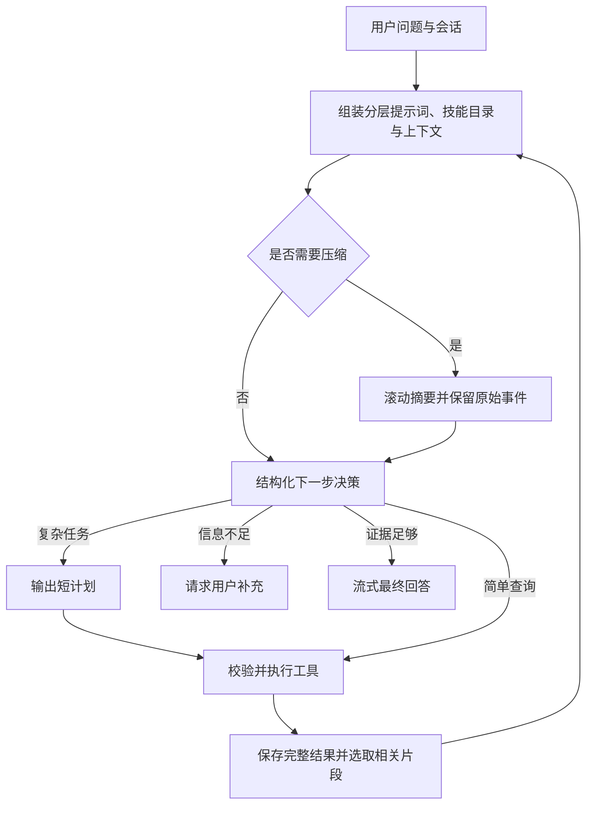

# DCN 网络智能体后端

输入用户问题，输出 SSE 结构化事件流。默认模型 `qwen2.5:3b`，默认监听 `0.0.0.0:8080`。
全部运行在本地；不包含前端。

开发和调试统一使用 `conda activate agent310`。常规命令无需 `-X utf8`；这个参数只是开启 Python 的 UTF-8 默认编码模式，Windows 终端遇到中文乱码时可以使用。项目文件读写已明确指定 UTF-8。

## 启动与调用

```powershell
# 使用系统已有的 conda agent310 环境（Python 3.10+）
conda activate agent310
python -m pip install -r requirements.txt

# 可选：接入真实 MCP，使用你的实际地址
$env:MCP_SERVER_URL = "http://localhost:8000/mcp"
# $env:MCP_API_TOKEN = "你的服务令牌"

python run_server.py
```

另开终端执行：

```powershell
python chat_client.py "查询 leaf-01 的 Ethernet1/1 接口状态" --session-id "dcn-001"
# 调用方提前确定 session_id；下一轮继续传入同一个 ID
python chat_client.py "继续检查相关日志" --session-id "dcn-001"
```

HTTP 输入：

```http
POST /v1/chat/stream
Content-Type: application/json
X-User-ID: local

{"message":"查询 leaf-01 的 Ethernet1/1 接口状态","session_id":"dcn-001"}
```

`session_id` 必传，由调用方生成并保持稳定。首次收到某个 ID 时自动建立会话；以后相同 ID 延续历史，不同 ID 分开存储。响应头 `X-Session-ID` 和 `X-Run-ID` 返回会话与本轮执行 ID。
后续请求带同一个 session_id 和 X-User-ID 即可延续历史。
session_id 支持 1..128 个字母、数字及 `- _ .`，建议使用调用方生成的 UUID；不能以点开头或结尾，不能包含冒号、空白或路径分隔符，不能使用 CON、NUL、COM1 等 Windows 保留名称。不同会话不能只靠大小写区分，后续请求应使用同一个完整 ID。
浏览器调用时用 `fetch` 读取 POST 响应流；原生 `EventSource` 只支持 GET。

仅提供业务接口；自动文档接口已关闭。`/health` 检查进程与配置，不代表模型/MCP 服务连接正常。

## 处理流程



每次工具返回后，下一次决策要求提供简短 `reflection`，评估当前证据与缺口。
规划由模型根据任务复杂度决定；不是所有问题都强制生成计划。

`config.toml` 的 `[agent]` 下，`allow_clarification = true` 允许缺少必要信息时请求用户补充；设为 `false` 则移除该决策分支，围绕本轮原始问题继续执行，最终回答也不再追问。默认开启，修改后重启服务生效。
关闭后如果仍无法获得必要参数，会完成可执行部分并说明限制，不编造参数；原有步数、超时等执行限制仍有效。
控制决策使用同一份 JSON Schema 约束生成并校验，模型输出不会直接作为 Python 或 shell 代码执行。
工具参数还会单独经过本地 schema / MCP 服务输入 schema 校验。
这里的 schema 就是“参数格式说明”。例如工具要求 `device` 是必填字符串，传 `{"device":123}` 或漏掉该字段会直接返回错误。
本地检查 `mcp.call` 的 server/name/arguments 等外层参数，MCP 工具定义检查内层业务参数。这只检查格式，不证明设备实际存在或操作已成功。
最终回答独立流式生成；`reasoning` 是简短决策说明，`reflection` 是证据评估。

## SSE 事件协议

每条事件形如（opencode 风格信封，`properties` 携带事件内容）：

```text
id: 12
data: {"id":"evt_18f3a2b4c5d6e7f80921a3b4","type":"message.part.updated","properties":{"sessionID":"ses_dcn-001","part":{"id":"prt_...","messageID":"msg_...","sessionID":"ses_dcn-001","type":"tool","tool":"mcp.call","callID":"call_...","state":{"status":"running","input":{"server":"demo","name":"get_interface_status","arguments":{"device":"leaf-01","interface":"Ethernet1/1"}},"metadata":{"step":2},"time":{"start":1790000000000}}}},"time":1790000000001}}

```

`id` 行是本轮内递增的序号（从 1 开始），可用于 `GET /v1/runs/{id}/events?after_seq=N` 补读；
`properties.time` 与分段 `time` 为毫秒时间戳。MCP 工具名示例来自本项目的演示服务。

流开始先发送 `server.connected`；空闲期间发送 `server.heartbeat`。事件类型：

| type | properties 内容与含义 |
| --- | --- |
| `server.connected` / `server.heartbeat` | 连接建立与空闲心跳，无业务字段 |
| `session.updated` | sessionID、info（id、slug、title、model、tokens、time）；本轮开始 |
| `session.status` | sessionID、status.type=busy/idle |
| `session.idle` | sessionID、status（最终状态）、steps、runID；本轮结束 |
| `message.updated` | sessionID、info：用户/助手消息；助手消息完成时带 finish 与 tokens |
| `message.part.updated` | sessionID、part、time；分段见下表 |
| `message.part.delta` | sessionID、messageID、partID、field=text、delta：最终回答增量文本 |
| `context.compressed` | before/after_tokens_estimate、compressed_messages、fallback |
| `model.retry` | 结构化输出修复；artifact_id 指向无效输出诊断记录 |
| `clarification` | question：需要用户补充的信息 |
| `limit` | max_steps 或重复调用限制 |
| `skill.loaded` | name、active_skills |
| `error` | code、message；流已开始后通过事件报告错误 |

`message.part.updated` 的分段（part）类型：

| part.type | 含义 |
| --- | --- |
| `step-start` | 一次模型调用开始；metadata 带 phase=decision/answer、step、attempt |
| `reasoning` | 决策文字；metadata.kind=plan/summary/reflection 区分计划、当前步骤说明与证据评估 |
| `tool` | 工具调用；state.status=pending → running（input 为参数）→ completed/error（output 为完整结果 JSON 字符串，metadata 带 truncated、ok、artifact_id、chars） |
| `step-finish` | 步骤结束；reason=tool-calls/stop，tokens 为 UTF-8 字节估算 |
| `text` | 用户消息原文或最终回答全文；最终回答增量经 `message.part.delta` 传输 |

每个决策步骤对应一条助手消息（`msg_<run_id>s<step>`），最终回答为独立消息（`msg_<run_id>f`）。
`tokens` 字段是保守估算值，不是精确 tokenizer 计数。
状态包括 `completed`、`needs_input`、`incomplete`、`error`、`timeout`、`cancelled`、`interrupted`。
`completed` 表示智能体正常给出最终回答，具体修复是否验证成功仍以回答中的证据为准。
达到步数/重复调用上限时返回 `incomplete`。断开连接会取消当前 run；取消/超时不代表远端操作必定没有执行。
队列有上限，慢客户端会产生背压；流量与背压时间计入整轮总时限。

参数无效、会话不存在、同会话并发分别在流开始前返回 HTTP 400/422、404、409。
不要对同一个问题自动重发 POST：重发是新 run，可能重复执行工具。

## 1. Skill 渐进式加载

```text
skills/
  dcn-diagnosis/
    SKILL.md
    scripts/counter_ratio.py
    references/workflow.md
    assets/report-template.md
  log-analysis/
    SKILL.md
    references/search-guide.md
```

遵循 Agent Skills 的文件布局：目录名与 YAML frontmatter 中的 name 相同，必需字段为 name、description。
约定参考目录为 `references/`；若已有技能用了 `resference/` 等自定义目录，正文中的实际路径仍可通过 skill.read 读取。
示例：

```markdown
---
name: my-skill
description: 描述技能用途和适用条件。
---

# 操作流程
具体步骤……
必要时读取 references/details.md。
```

加载分三层：

1. 启动时只读取 frontmatter。初始模型上下文只有有限的名称/描述目录，更多技能可用 `skill.list` 筛选和分页。
2. 模型选择 `skill.load` 后加载 SKILL.md 正文与文件名列表。当前激活技能的指令片段每轮注入，防止压缩后遗忘流程。
3. 参考资料、模板或脚本用 `skill.read` 按需读取；路径限于该技能目录，支持字符分页。长正文同样保存为 artifact。

`skills.max_active` 限制同时激活的技能数量，超过时移出最早激活的技能；可再次加载。
新增/修改 Skill 后重启服务刷新目录。`skills.allow_scripts=true`（默认）允许 `skill.run`，设为 `false` 则隐藏该工具并拒绝执行。脚本视为可信，运行时无需用户额外确认。
可保留其他标准 frontmatter 字段；本版本主要使用 name/description，不根据 `allowed-tools` 自动授权，实际工具范围由 MCP allowed_tools 和脚本开关控制。
仅运行该 skill 的 scripts/ 下的 Python 文件，使用参数数组，无 shell，限制执行时间；输出直接写入会话的 results/，不设长度上限。
脚本直接在本机运行，继承后端进程的环境变量和用户权限，没有 OS 沙箱。工作目录为对应 Skill 目录。

```toml
[skills]
allow_scripts = true
python_path = ""            # 留空沿用后端 Python；可填目标环境的 Python 可执行文件路径
script_timeout_seconds = 300 # 脚本启动后最多等待 300 秒
```

指定解释器可使用 Windows 的 `C:/Miniconda/envs/agent/python.exe` 或 Linux 的 `/opt/conda/envs/agent/bin/python`；相对路径以配置文件目录为基准，修改后重启。该配置只选择脚本解释器，不改变后端环境，也不执行 `conda activate`；脚本依赖需安装在目标环境中。

参数数组例如 `["--total", "100", "--errors", "2"]`，每项原样作为一个命令行参数传给脚本。无 shell 表示直接启动 Python，不经过 PowerShell、cmd 或 bash，因此不会解析管道、重定向、变量展开等 shell 语法；这不代表沙箱。
执行时将标准错误合并到标准输出，由操作系统直接写入会话结果文件，不把完整输出放进内存。Python 使用 `-u` 及时输出；结束后每次读取最多 65536 个字符，生成可下载的结果 JSON 并统计字符数。
短输出完整返回；长输出复用 `agent.tool_result_tokens` 预算，只向模型返回相关片段和 artifact_id，可继续用 `artifact.search/read` 检索原文。完整输出不因过长而截断或终止脚本，原有 `script_output_bytes` 配置已移除。
超时返回 `status="timeout"`、`ok=false` 并终止仍运行的脚本，已写入文件的输出仍保留，取消执行时也保留输出。长输出结果包含执行状态和退出码；文本检索将无效 UTF-8 字节显示为替换字符，原始字节仍在 .txt 文件中。脚本自行启动的外部子进程不在当前终止范围内。

## 2. MCP

支持 Streamable HTTP，复用 `dcn_agent/mcp_calling.py`。可以通过环境变量配置单个服务，或配置多个服务：

```toml
[mcp.servers.dcn]
url = "http://localhost:8000/mcp"
token_env = "MCP_API_TOKEN"
allowed_tools = ["get_interface_status", "get_device_logs"]
```

服务名 `dcn` 对应 `mcp.call.arguments.server`。`allowed_tools=[]` 表示允许该服务所有已发现工具。
服务令牌只从指定环境变量读取。工具不会自动重试。

- `mcp.list_tools`：按 query 筛选、offset/limit 分页返回真实工具定义和参数 schema。
- `mcp.call`：校验真实工具与参数后执行；不存在的名称返回错误和可用工具提示。

当前每次查询/调用建立并关闭一个 MCP 会话，不实现跨调用长连接池或 OAuth 登录流程。
用于修改设备的权限由实际 MCP 服务及其认证控制；本后端的模型提示词不能代替服务端权限校验。

## 3. 上下文与压缩

主要配置：

```toml
[model]
transport = "ollama"
context_window_tokens = 16384
max_output_tokens = 1536
safety_margin_tokens = 1024
compression_trigger_ratio = 0.80
summary_tokens = 1000
```

这些参数控制模型接口、单次调用容量和历史压缩，不限制整个会话的轮数，也不限制工具原始结果大小。修改 `config.toml` 后重启后端生效。

| 参数 | 当前实现中的含义 | 何时修改及影响 |
| --- | --- | --- |
| `transport` | `ollama` 使用原生 `/api/chat`，显式设置上下文窗口；`openai` 使用 OpenAI 兼容接口。 | 切换模型服务的接口协议时修改。本机 Ollama 可保持 `ollama`；`openai` 模式需另行配置服务端真实窗口。 |
| `context_window_tokens` | 单次模型调用的总窗口，输入和生成的输出共同占用。输入包含提示词、技能、摘要、近期记录和当前问题。 | 排障流程长、频繁压缩且需要更多历史细节时考虑增大；必须符合模型和运行环境的实际承载能力，不能只修改本地数值。 |
| `max_output_tokens` | 普通决策或最终回答单次生成的输出上限，不是整个 ReAct 流程的总输出量。摘要调用另用 `summary_tokens`。 | 回答经常被截断或出现“模型达到输出长度限制”时增大；同一总窗口下，增大会减少可用输入空间。 |
| `safety_margin_tokens` | 为预算估算误差、聊天模板等开销预留空间，不对应某段实际内容。 | 本地预算检查通过，但服务端仍报告窗口不足时，先核实服务端窗口配置，再考虑增大；通常保持当前值。 |
| `compression_trigger_ratio` | 输入估算量超过可用输入预算的该比例时，尝试压缩旧历史；不是总窗口占比，也不是压缩后长度比例。 | 希望更早压缩时调低；压缩频繁、希望保留更多近期原始记录时调高。取值范围为大于 0、且不超过 1。 |
| `summary_tokens` | 滚动历史摘要的预算，同时用于摘要生成输出上限和保存时的裁剪。 | 压缩后容易丢失设备信息、已执行步骤或关键证据时增大；摘要越长，近期原始记录可用空间越少。 |

按上面的配置计算：

```text
可用输入预算 = 总窗口 − 输出预留 − 安全余量
             = 16384 − 1536 − 1024
             = 13824

压缩触发阈值 = floor(13824 × 0.80)
             = 11059
```

输入估算量超过 11059 时尝试压缩旧历史。当前目标和系统规则等固定内容不会因此被删除；如果没有历史可压缩，或固定内容本身过大，不能单靠调低触发比例解决。

每次推理前计算输入预算：窗口减去预留输出与安全余量。使用 UTF-8 字节数加消息开销进行保守估算，
不是精确 tokenizer 计数，因此通常会提前压缩。`context.compressed` 中明确标记估算方法。

注意：传给模型服务的生成上限是真正的 token 数，但本地预算与文本裁剪使用 UTF-8 字节数。因此 `summary_tokens=1000` 保存摘要时最多保留约 1000 字节，不是 1000 个汉字；以常见中文汉字为主时约三百字，截取标记也占空间。不要把这些参数直接当作字数。

调整时按现象选择参数，每次只改相关项，便于比较效果：

- **回答或决策输出被截断**：检查 `max_output_tokens`，必要时增大，并重新计算输入预算。
- **压缩后忘记关键事实**：检查 `summary_tokens`，必要时增大；重要结论仍应通过 artifact 原文复核。
- **频繁出现 `context.compressed`**：先看输入是否包含过多提示词或工具片段，再考虑增大窗口或适度提高触发比例。
- **固定提示词或当前问题过大**：减少提示词、激活技能或输入量，或提高实际可用窗口；修改触发比例不能消除固定内容。
- **压缩事件出现 `fallback=true`**：检查摘要调用的连接、超时或输出错误；这表示摘要生成失败后使用了截取降级，不是正常压缩。

当前配置校验要求：可用输入预算至少为 2048，`summary_tokens` 不超过可用输入预算的三分之一。调整窗口、输出上限或安全余量时，要同时检查这两个条件。

超阈值时将较旧的执行记录分批压缩为滚动摘要，保留当前目标、用户约束、事实、未完成计划和 artifact 引用。
压缩请求本身也分批并校验预算；不把整份超长历史再次直接传给模型。
系统规则、当前用户目标与激活技能单独组装；摘要失败时使用有明确降级标记的历史截取并发送 fallback=true。
如果固定提示词/当前问题本身过大，会返回明确错误，不静默丢掉当前用户目标。

SQLite 同时保存完整用户消息与执行事件；压缩只修改下一轮使用的工作上下文。
摘要是有损表示，不能保证每个细节都保留，重要结论应通过 artifact 原文复核。

后端默认走 Ollama 原生 `/api/chat`，为每次请求显式设置 `options.num_ctx`。
`base_url` 可继续配置为 `http://localhost:11434/v1`，原生适配器会使用同一服务的 `/api/chat`。
可设 `transport="openai"` 使用已有兼容脚本；此模式下**本地预算不会修改服务端真实窗口**，需自行将模型服务窗口配置为相同或更大值。

## 4. MCP 超长返回

完整结果保存为 `data/sessions/<session_id>/results/<id>.json`，另存用于检索的文本视图。SQLite 记录所属会话、run、来源和字符总数。
短结果直接进入上下文；超过 `agent.tool_result_tokens` 时返回有限的关键词命中片段、头尾片段和 artifact_id。

单行日志也可搜索：

```json
{"name":"artifact.search","arguments":{"artifact_id":"结果ID","terms":["Ethernet1/1","loss_of_signal"],"offset":0,"limit":4,"radius":200}}
```

然后读取相关位置：

```json
{"name":"artifact.read","arguments":{"artifact_id":"结果ID","offset":219800,"limit":2000}}
```

这些是模型调用本地检索工具时填写的参数，不是要求用户手动填写的配置。模型从已有工具结果取得 artifact_id，根据问题选择关键词，再根据搜索返回的位置读取原文。可选参数不传时使用默认值。

| 工具 | 参数 | 含义及默认值（模型调用范围） |
| --- | --- | --- |
| 两者 | `artifact_id` | 必填，之前工具返回的完整结果 ID；只能访问当前会话的结果。 |
| `artifact.search` | `terms` | 必填，1..20 个字面关键词，每个最多 256 字符；忽略大小写，任一关键词命中即可，不是正则或 AND 查询。 |
| `artifact.search` | `offset` | 从哪个字符位置开始寻找匹配，从 0 计数，默认 0。 |
| `artifact.search` | `limit` | 最多返回多少个匹配项，默认 6，范围 1..10；不是字符数或日志行数。 |
| `artifact.search` | `radius` | 每个命中前后各保留多少字符，默认 180，范围 0..500；到文件边界时可能不足。 |
| `artifact.read` | `offset` | 从哪个字符位置开始读取，从 0 计数，默认 0。 |
| `artifact.read` | `limit` | 最多读取多少字符，默认 2000，范围 1..4000；与搜索 limit 的含义不同。 |

搜索示例表示从文件开头查找 Ethernet1/1 或 loss_of_signal，最多返回 4 个匹配项，每个附带前后各 200 个字符。读取示例表示从字符位置 219800 开始，最多读取 2000 个字符；219800 只是示例，实际应根据搜索结果选择。
搜索返回的 `offset` 是片段起点，`match_offset` 是关键词起点。用 `next_offset` 继续同一种操作，`eof=true` 表示已经到文件末尾。上述范围是模型工具入口的限制，HTTP 手动查询接口允许的上限可能更大。
这些含义、默认值、范围和翻页规则已写入 `prompts/controller.md`，每次决策都会提供给模型，不依赖先加载日志分析 Skill；工具目录另提供名称、类型与必填标记。

搜索流式扫描文本文件，保留块边界重叠，返回匹配位置与 next_offset；字符偏移适用于中文，不是字节数或行号。
terms 是不区分大小写的字面词 OR 搜索，不执行模型提供的正则表达式。用 next_offset 继续搜索，直到 eof=true。
同一机制可处理结构化 JSON 文本。原始完整对象可通过 `/raw` 接口下载。

这是关键词检索与字符窗口方案，没有引入向量数据库。自动片段不保证语义召回所有相关内容。
MCP SDK 在接收时仍会将单次结果缓存在内存；该机制限制的是**模型上下文和对外事件大小**，不能消除接收阶段的内存峰值。
对于 GB 级日志，应让 MCP 服务提供时间/字段过滤、分页或文件引用，而不是一次返回整份日志。

## 5. 多轮会话与持久化

- SQLite 保存 user/session 提示词、工作上下文、摘要、激活技能、完整消息、run 状态和事件。
- 同会话同时只允许一个 run，不同会话可以并行。
- 进程重启后历史仍可用，启动时把未结束 run 标为 interrupted，不自动重放工具。
- `GET /v1/runs/{id}/events?after_seq=N` 可分页读取已保存事件，支持调用方补读；不是自动恢复执行或 SSE 断点续跑。
- 存储默认在 data/，本版本不自动清理旧数据。
- 每个会话只有一个 `data/sessions/<session_id>/session.log`，不同轮次追加并用 run_id 区分。
- 完整工具结果位于该会话的 `results/`，日志只记录结果片段和 artifact_id，避免大段原文干扰阅读。
- 文件目录直接使用原始 session_id；MCP 和脚本结果统一放在该会话的 results/ 下。

## 6. 分层提示词

| 层级 | 配置方式 | 生效范围 |
| --- | --- | --- |
| 系统 | prompts/system.md | 所有请求；修改后重启 |
| 用户长期偏好 | PUT /v1/prompts/user | X-User-ID 对应用户的后续 run |
| 会话偏好 | PUT /v1/sessions/{id}/prompt（可在第一条消息前设置） | 当前会话后续 run |
| 阶段 | controller.md / final.md / compress.md | 决策、最终回答、压缩阶段 |
| Skill | SKILL.md 与按需参考文件 | 当前激活技能 |

冲突约定：系统规则 > 会话偏好 > 用户长期偏好。用户问题仍是当前执行目标，偏好不能授权额外操作。
运行开始时快照用户与会话提示词；执行中修改在下一轮生效。工具内容作为证据数据，不提升为系统提示词。

## API 索引

所有 `/v1` 接口接收 `X-User-ID`（默认 local），路径中的会话/run/artifact 会按该用户归属检查。

| 方法与路径 | 用途 |
| --- | --- |
| POST /v1/chat/stream | 输入 message 和必填 session_id，返回 SSE |
| GET /v1/sessions/{id} | 查看会话摘要、提示词和激活技能 |
| GET /v1/sessions/{id}/messages | 完整用户/助手消息，after/limit 分页 |
| PUT /v1/prompts/user | 设置用户提示词 |
| PUT /v1/sessions/{id}/prompt | 设置会话提示词 |
| GET /v1/skills | 查询技能元数据 |
| GET /v1/runs/{id} | 查询状态 |
| GET /v1/runs/{id}/events | after_seq/limit 分页读取事件 |
| POST /v1/runs/{id}/cancel | 取消执行 |
| GET /v1/sessions/{id}/artifacts/{aid} | offset/limit 读取文本 |
| POST /v1/sessions/{id}/artifacts/{aid}/search | 输入 terms、offset、limit、radius 搜索 |
| GET /v1/sessions/{id}/artifacts/{aid}/raw | 下载完整原始 JSON |

这是单进程、单 worker 后端；不要让多个服务实例同时使用同一 data 目录。
默认绑定 localhost，X-User-ID 用于本地/受信任上游的会话划分，**不是身份认证**。
若供其他客户端访问，可设置 DCN_API_TOKEN；对外多租户部署还需接入可信身份认证，将身份映射为用户 ID。

## 无真实设备的联调

本项目提供模拟 MCP 服务，所有数据明确标记为 DEMO；不会访问真实设备。

```powershell
# 终端一
python demo/demo_mcp_server.py
# 终端二
$env:MCP_SERVER_URL = "http://127.0.0.1:8000/mcp"
python run_server.py
# 终端三
python chat_client.py "查询模拟设备 leaf-01 的 Ethernet1/1 状态，若 down 再查询日志并给出证据，仅查询不修复" --session-id "demo-001"
```

## 代码位置

- `dcn_agent/engine.py`：ReAct 循环、事件、限制、取消与检查点。
- `dcn_agent/api.py`：HTTP/SSE、会话与提示词接口、事件回读。
- `dcn_agent/context.py`：预算与滚动压缩。
- `dcn_agent/artifacts.py`：完整结果保存、字符分页、跨块检索。
- `dcn_agent/skills.py`：元数据、正文、资源和脚本加载。
- `dcn_agent/tools.py`：本地工具与 MCP 路由、输入校验。
- `dcn_agent/model.py`：Ollama 原生流式 / OpenAI 兼容适配。
- `dcn_agent/storage.py`：SQLite 持久化。
- `dcn_agent/llm_calling.py`、`dcn_agent/mcp_calling.py`：可独立复用的基础调用函数。

项目不保留 tests、unittest 或测试输出文件。可使用上面的演示 MCP 和聊天客户端检查完整流程。

## 参考

- [Agent Skills 目录与 frontmatter 规范](https://agentskills.io/specification)
- [FastAPI 流式响应](https://fastapi.tiangolo.com/advanced/custom-response/)
- [Ollama 结构化输出](https://docs.ollama.com/capabilities/structured-outputs)
- [Ollama OpenAI 兼容接口与上下文窗口说明](https://docs.ollama.com/api/openai-compatibility)


## 前端故障诊断对接

启动 `python frontend/app.py` 后访问 http://127.0.0.1:8090；需同时运行后端及配置的 MCP 服务。前端代理原样转发 `/v1/chat/stream` SSE。详细启动、拓扑字段、会话与卡片交互说明见 [frontend/README.md](frontend/README.md)。

根目录 `[frontend]` 配置前端监听端口和 backend_url；`[topology]` 配置用于背景拓扑查询的 MCP 服务名及三个工具名。默认接入 `[mcp.servers.demo]`，替换真实服务时更新地址、工具名和 allowed_tools。已有显式 MCP 配置时，原有 MCP_SERVER_URL 自动回退不会覆盖这些服务。

GET `/v1/topology?fabric_id=...`：经相同用户/令牌检查后调用三个只读 MCP，返回 fabrics、deviceInfo、fabricId、nodes、links。用于页面背景拓扑，不作为模型故障证据，也不写入某个诊断会话；模型仍通过自己的 MCP 工具查询取得证据。Pod 必须由真实数据的 podId/podName 提供；缺少时显示“Pod 未提供”。

## 问答范围与故障处置边界

同一个聊天入口支持普通问答、协议解释、系统能力查询和故障诊断，不要求每轮都制定计划或调用工具。历史中加载过故障技能，也不意味着后续天气或知识问题必须走排障流程。

| 用户问题 | 预期执行方式 |
| --- | --- |
| 你好、解释 EVPN/VXLAN | 可直接生成流式回答，无需查询设备 |
| 今天天气怎么样 | 先判断有无实时天气工具；目前未配置，不能编造天气。补充信息开关不提供额外的数据获取能力 |
| 有哪些 MCP | 配置目录提供服务名，mcp.list_tools 发现各服务开放的工具，按 total/next_offset 翻页；配置存在不等于在线 |
| 有哪些 skill | skill.list 查询元数据并按需翻页 |
| 某个 skill 有什么内容 | skill.load 取得正文和文件目录，再用 skill.read 分页读取；只查看内容不执行脚本 |
| 按故障技能排查 | 加载相关技能，按需读取参考文件和运行脚本，结合 MCP 证据继续决策 |
| 修复后验证 | 需要真实修复工具和相应状态、业务验证工具；仅有查询工具时只能诊断并给出建议 |

技能目录在服务启动时扫描，新增技能需重启。每个激活技能进入系统提示词的正文受 instruction_tokens 限制，摘录会明确提示；完整内容仍可通过 skill.load 的结果或 skill.read 获取。脚本使用 skills.python_path 指定的本机解释器，无需额外确认；script_timeout_seconds 独立控制脚本时间，不受 MCP 的 tool_timeout_seconds 提前截断，但仍受整轮 max_run_seconds 限制。脚本输出不设长度上限，统一保存和检索。

演示 MCP 支持多 Pod 双故障、独立 case_id、模拟修复和业务复查，完整操作见 [demo/README.md](demo/README.md)。演示工具只修改模拟状态，**尚不具备真实设备自动修复能力**。引擎可以调用接入的真实修复 MCP，再调用验证 MCP，但不会自动替服务定义业务恢复标准、补偿或回滚逻辑；这些需要在实际工具和故障技能中明确。session.idle 的 completed 仅表示本轮回答正常结束，不代表故障已消除。超时或取消也不代表已执行的设备变更被撤销，下一轮应重新查询确认。


前端支持表格和代码块、折叠工具卡片、长结果分页读取。拓扑辅助查询不阻塞回答流，运行结束后清除“正在排查”标记；异常标记只代表最近取得的证据。多个接口分别记账，不能用一个接口正常来清除另一个接口异常。隐患页面仍为演示功能，其模拟告警不在故障问答页面弹出。

## 独立调用模块

## MCP：Streamable HTTP

使用完整的 MCP 服务地址（路径由服务端决定）：

```powershell
$env:MCP_SERVER_URL = "http://localhost:8000/mcp"
# 如果服务需要 Bearer Token：
# $env:MCP_API_TOKEN = "你的 Token"
python -B -m dcn_agent.mcp_calling
```

以上地址只是示例，需要替换为真实地址。直接运行脚本会列出工具名称、描述和参数 schema。
也可以通过函数的 `server_url=`、`headers=` 显式传配置；显式请求头覆盖同名默认请求头。
脚本读取进程环境变量，不自动加载 `.env` 文件。

在其他脚本中调用：

```python
import asyncio
import json
from dcn_agent.mcp_calling import multi_mcp_calling

async def main():
    res = await multi_mcp_calling([
        {"name": "queryXX", "param": {"paraname1": "value1", "paraname2": "value2"}}
    ])
    print(json.dumps(res, ensure_ascii=False, indent=2))

if __name__ == "__main__":
    asyncio.run(main())
```

`queryXX`、参数名和参数值是占位示例，请用服务端真实工具替换。
每个输入对应一个返回项，顺序不变，重复调用同名工具不会覆盖结果：

```json
[
  {
    "name": "queryXX",
    "ok": true,
    "text": "工具返回的文本",
    "data": {"status": "正常"},
    "content": [{"type": "text", "text": "工具返回的文本"}],
    "error": null
  }
]
```

- `data` 保存服务返回的 `structuredContent`，未提供时为 `None`；不会猜测文本的 JSON 含义。
- `content` 保留全部内容块，包括图片、资源等非文本结果；`text` 只拼接文本块。
- 工具错误、调用超时或连接失败通过 `ok=False`、`error` 返回；输入/配置错误抛出 `ValueError`。
- 默认 `timeout=60` 秒，限制初始化和每次工具调用（不含并发排队时间）；并非整个批次总时限。
- 默认 `max_concurrency=1`，单项失败仍继续后续项。多个独立查询可传 `max_concurrency=4`。
- 一个批次共用一个 MCP 会话；本接口调用同一服务的多个工具，不做跨服务自动路由。
- 不自动重试。超时/断连仅代表客户端未取得结果，不能据此判断服务端操作没有执行。
- `await list_mcp_tools()` 可取得工具及输入 schema；它的连接错误直接向调用方抛出。

## Ollama 大模型

默认连接参数：

```text
base_url = http://localhost:11434/v1
api_key = ollama
model = qwen2.5:3b
```

确保 Ollama 已运行且已拉取 `qwen2.5:3b`。直接运行默认流式打印：

```powershell
python -B -m dcn_agent.llm_calling "请介绍一下 DCN 网络故障排查"
python -B -m dcn_agent.llm_calling "test" --no-stream
```

同步调用：

```python
from contextlib import closing
from dcn_agent.llm_calling import call_llm, stream_llm

messages = [
    {"role": "system", "content": "你是 DCN 网络运维助手。"},
    {"role": "user", "content": "test"},
]
answer = call_llm(messages)
print(answer)

parts = []
with closing(stream_llm(messages, temperature=0.2)) as chunks:
    for chunk in chunks:
        print(chunk, end="", flush=True)
        parts.append(chunk)
print()
full_answer = "".join(parts)
```

与异步 MCP 集成时使用异步接口：

```python
import asyncio
from contextlib import aclosing
from dcn_agent.llm_calling import acall_llm, astream_llm

async def main():
    answer = await acall_llm("test")
    print(answer)
    async with aclosing(astream_llm("test")) as chunks:
        async for chunk in chunks:
            print(chunk, end="", flush=True)
    print()

if __name__ == "__main__":
    asyncio.run(main())
```

四个函数都接受字符串或 `messages` 列表，可显式设置 `model`、`base_url`、`api_key`、
`timeout`（默认 120 秒，HTTP 超时，不是整段生成的总时限），及兼容的 `temperature`、`max_tokens` 等参数。
也可设置 `OLLAMA_BASE_URL`、`OLLAMA_API_KEY`、`OLLAMA_MODEL` 环境变量。
连接/模型错误保留 OpenAI SDK 原始异常，便于上层处理；不自动重试，流式中断不会重新生成并重复输出。
流式函数返回文本增量，不自动打印、不存储对话历史，也不自动执行模型输出的工具调用。
如提前 `break`，请像示例一样用 `closing` / `aclosing` 及时释放连接。

## 接口参考

- [OpenAI Docs：Chat Completions 流式事件](https://developers.openai.com/api/reference/resources/chat/subresources/completions/streaming-events)
- [MCP 官方 Python SDK v1 客户端文档](https://github.com/modelcontextprotocol/python-sdk/blob/v1.x/docs/client.md)

依赖限定 MCP SDK 1.x，以匹配当前脚本采用的 `ClientSession` 接口。
